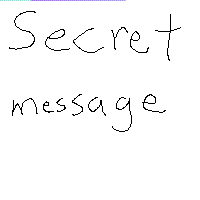
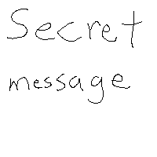
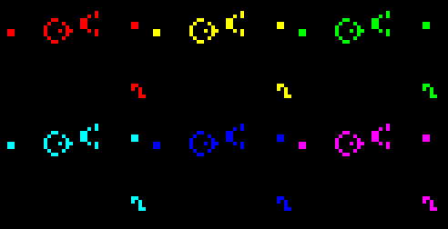

# Game of Life

> 更多请参见 [Game of Life](https://inst.eecs.berkeley.edu/~cs61c/fa20/projects/proj1/#the-game-of-life)。

此文档记录，遇见的 bugs 与输出。

[TOC]

## Part A1

1. `writeData()`

```c
ERROR SUMMARY: 2 errors from 2 contexts (suppressed: 0 from 0)
Segmentation fault (core dumped)
make: *** [Makefile:18: imageloader] Error 139 => 试图访问未分配内存地址
```

观察到输出文件 `JohnConway.ppm` 有 203 行，4-202行 每行 201 个像素，203 行 一个像素，共 40000。总像素数量等于 200\*200，一行字符数大于 200，行数小于 203。

经过 debug 发现存在于 循环体：

```c
Color **p = img->image; // pixel pointer
for (int i = 0; i < rows; i++) {
    /* 此处 cols=200，再加上换行输出，共201像素 */
    for (int j = 0; j < cols; j++) {
        printf("%3hhu %3hhu %3hhu   ", (*p)->R, (*p)->G, (*p)->B);
        p++;
    }
    printf("%3hhu %3hhu %3hhu\n", (*p)->R, (*p)->G, (*p)->B);
    p++;
}
```

改 `for(int j=0;j<cols;j++)` 为 `for(int j=0;j<cols-1;j++)`，解决，输出正确。

---

输出：


## Part A2

1. `steganography()`

输出：



第一行不应该是有颜色的，应该全部为 `255 255 255`，前 126 个字符是有颜色的。只打印一行发现：一行全都有颜色。大概率是内存访问出错。

后检查初始化 `new_img` 代码发现，初始化出错：

```c
new_img->image = (Color **) malloc(sizeof(Color *)); // WRONG
new_img->image = (Color **) malloc(sizeof(Color *) * mrow * mcol); // RIGHT
```

---

输出：



## Part B

1. `main()`

输出：



得到的 gif 图仅有一帧一闪而过，其他全为黑色，显然是实现计算一个错误。——当我没说。

实际上是 `rule` 解析错误，原为：`rule = atoi(argv[2]` 

现改为：`rule = strtol(argv[2], NULL, 16);`

2. 无生命迹象

输出：


Game of Life 居然没有 life 的迹象……

根据 xkcd 的 ppm 文件，与正确的进行对比发现：生成的 ppm 只有 18行，而非 24行。18=3+15, 24=3+21。很有可能是输出时，行列出现错误——这在之前的 20x20 文件中无法发现。

```c
// readData()中读取第二行
fscanf(fp, "%u", &(img->rows));
fscanf(fp, "%u", &(img->cols));

// writeData()中写前三行
printf("P3\n%u %u\n255\n", rows, cols); // first 3 lines
```

调换 `rows` 和 `cols` 位置即可，真是一个蛋疼的错误。

---

xkcd 输出：


GliderGuns 输出：


