# Classify

> 更多请参见 [Classify](https://inst.eecs.berkeley.edu/~cs61c/fa20/projects/proj2/)。

此文档记录，遇见的 bugs 与输出。

[TOC]

```tree
.
├── inputs (test inputs)
├── outputs (some test outputs)
├── README.md
├── src
│   ├── argmax.s (partA)
│   ├── classify.s (partB)
│   ├── dot.s (partA)
│   ├── main.s (do not modify)
│   ├── matmul.s (partA)
│   ├── read_matrix.s (partB)
│   ├── relu.s (partA)
│   ├── utils.s (do not modify)
│   └── write_matrix.s (partB)
├── tools
│   ├── convert.py (convert matrix files for partB)
│   └── venus.jar (RISC-V simulator)
└── unittests
    ├── assembly (contains outputs from unittests.py)
    ├── framework.py (do not modify)
    └── unittests.py (partA + partB)
```


## Part A: Mathematical Functions

### Task 0

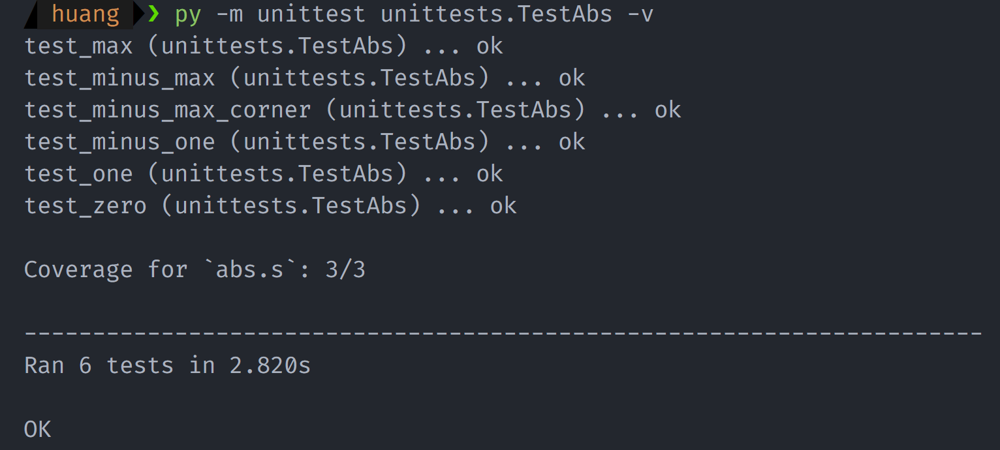

### Task 1

没有完全覆盖，不知道还有什么。

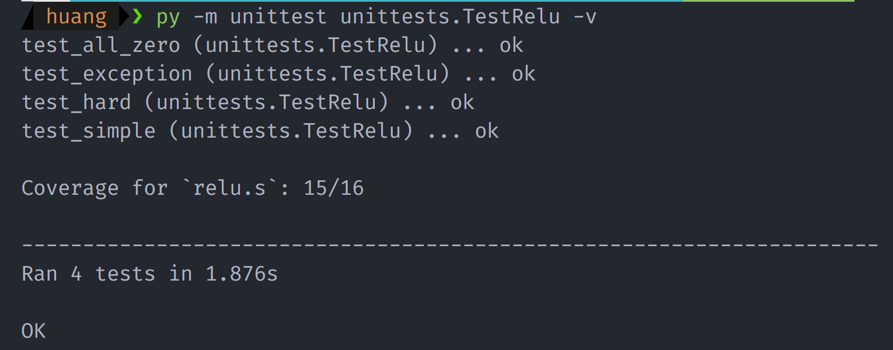

### Task 2

1. <s>误用不存在的寄存器 `t3`</s>

> 错误无法再现，反正需要用栈。

```assembly
# load next element
lw t3, 0(a0) # temp_next = array[i]
# if temp_next <= max, jump to loop_continue
ble t3, t2, loop_continue
mv t2, t3 # max = temp_next
add t1, a0, x0 # max_index = i
j loop_continue
```

对于寄存器不足的情况，可以使用栈去存储数据，修改为：

```assembly
# allocate memory
addi sp, sp, -8
sw s0, 0(sp)
sw s1, 4(sp)

add t0, x0, x0 # i = 0
#add s0, a0, x0 # max_index = 0
add s0, x0, x0
lw s1, 0(a0) # max = array[0], the first element
```

2. 返回参数错误

```
a0 (int)  is the first index of the largest element
```

应该返回 `index` 而非地址，修改即可。

---

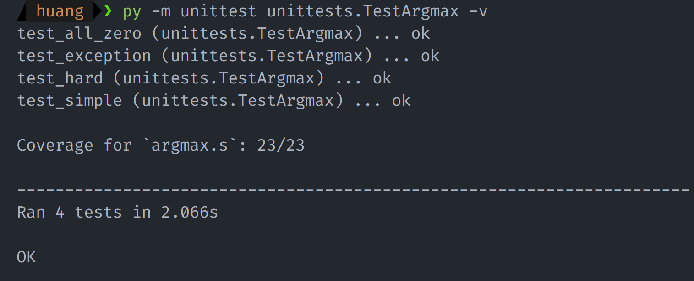

### Task 3.1

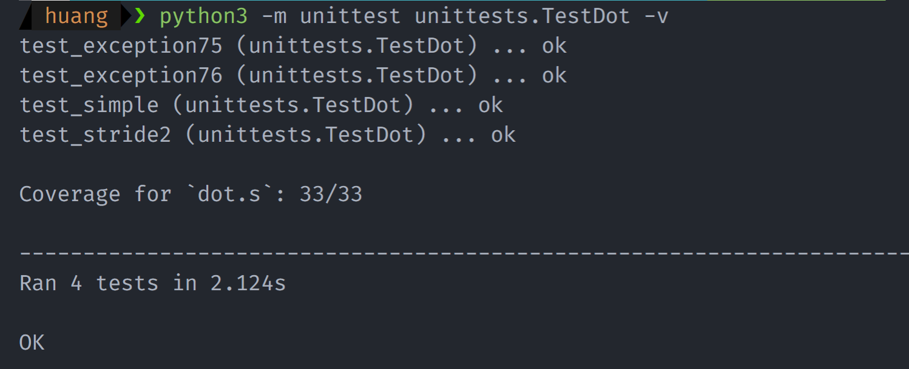

### Task 3.2

```c
// C语言代码
void matmul(int* m0, int r0, int c0, int* m1, int r1, int c1, int* d) {
    assert(r0 > 0 && c0 > 0 && r1 > 0 && c1 > 0 && c0 == r1);
    int i, j;
    for (i = 0; i < r0; i++) {
        for (j = 0; j < c1; j++) {
            d[i * c1 + j] = dot(m0 + i * c0, m1 + j, r0, 1, c1);
        }
    }
}
```

1. 输出错误

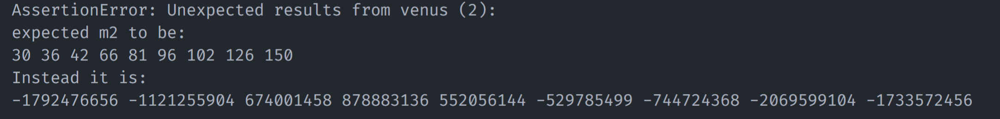

```assembly
inner_loop_start:
    mv a0, s0 # arr0 pointer
    li t2, 4
    mul t2, t2, t1 # j * 4
    add a1, s2, t2 # arr1 pointer

    mv a2, s1 # arr0 cols
    li a3, 1 # arr0 stride
    mv a4, s5 # arr1 cols, stride

    # code...
```

肉眼排查法：寄存器 typo 错误，`add a1,s2,t2` 改为 `add a1,s3,t2`。

2. 输出错误

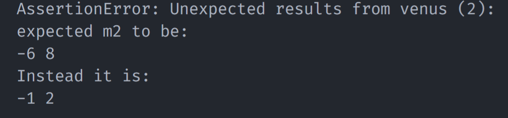

```assembly
inner_loop_start:
    mv a0, s0 # arr0 pointer
    li t2, 4
    mul t2, t2, t1 # j * 4
    add a1, s2, t2 # arr1 pointer

    mv a2, s1 # arr0 cols
    li a3, 1 # arr0 stride
    mv a4, s5 # arr1 cols, stride

    # code...
```

单步调试发现 `mv a2, s1` 存在 typo，改为 `mv a2, s2`

---

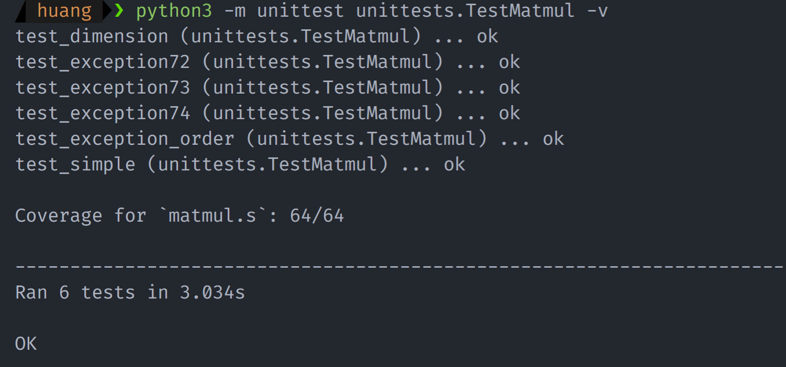

## Part B: File Operations and Main

### Task 1

```c
int* read_matrix(char* filename, int* row, int* col) {
    FILE* fp = fopen(filename, "r");
    if (fp == NULL)
        exit(90);

    int temp = fread(fp, row, sizeof(int));
    if (temp != 4)
        exit(91);
    temp = fread(fp, col, sizeof(int));
    if (temp != 4)
        exit(91);

    int size = (*row) * (*col) * sizeof(int);
    int* matrix = malloc(size);
    if (matrix == NULL)
        exit(88);
    temp = fread(fp, matrix, size);
    if (temp != size)
        exit(91);

    temp = fclose(fp);
    if (temp == -1)
        exit(92);
    return matrix;
}
```

1. 异常 `code=91`

后经单步调试发现在调用 `fopen` 函数时出现错误：

```error
Error: ENOENT: no such file or directory, open '/inputs/test_read_matrix/test_input.bin'
```

---

上述错误是由于在 Windows 中产生，因为 Windows 与此项目并不兼容。显然，`code=91` 错误出现在 `fread` 中，将采用肉眼排查法进行 debug：

```assembly
jal fread
li t0, 4
beq a0, t0, exit91 # fread error
```

显然，`beq` 应为 `bne`。

2. 异常 `code=88`

```assembly
# read file: row, col
mv a1, s3 # fp
mv a2, s1 # &row
li a3, 4  # sizeof(int)
jal fread
li t0, 4
bne a0, t0, exit91 # fread error
mv a2, s2 # &col
li a3, 4  # sizeof(int)
bne a0, t0, exit91 # fread error
lw s1, 0(s1) # row, only one byte
lw s2, 0(s2) # col
```

查看分配内存处发现没有错误，向前排查时发现：缺少一句 `jal fread` 指令，同时还需要对 `a1`, `a2`, `a3`, `t0` 重新赋值。

3. 输出异常

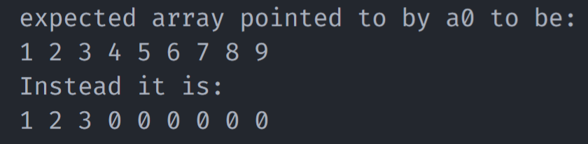

观察 bin 文件，发现此处打印出 123 就已经换行，故排除换行问题。

```bash
$ hexdump test_input.bin
0000000 0003 0000 0003 0000 0001 0000 0002 0000
0000010 0003 0000 0004 0000 0005 0000 0006 0000
0000020 0007 0000 0008 0000 0009 0000
000002c
```

经过反复尝试后，发现是传递给 `fread` 的参数出错——每个参数应当左移两位，以满足 `sizeof(int)` 的需求。添加一个存储与 `s5` 中的临时变量即可解决这个问题。

---

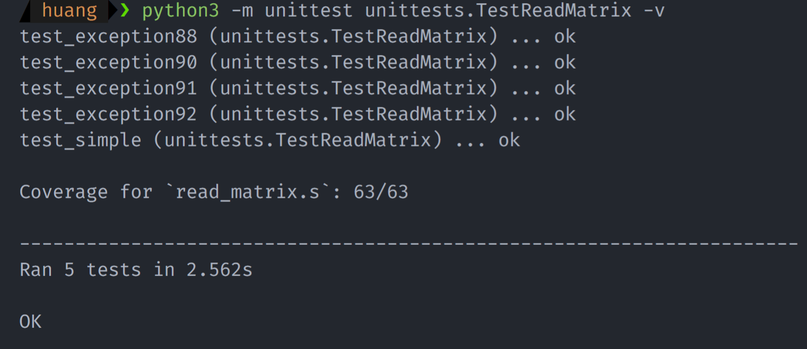

### Task 2

```c
void write_matrix(char* filename, int* matrix, int row, int col) {
    FILE* fp = fopen(filename, "w");
    if (fp == NULL)
        exit(93);

    /* 实际上本处可以采用 la 进行优化，但是为了简单起见，采用 lw 读取 */
    int* buffer = malloc(2 * sizeof(int)); // 分配给汇编下的a0，只是临时的，无需free
    buffer[0] = row;
    buffer[1] = col;
    int temp = fwrite(fp, buffer, 2, sizeof(int));
    if (temp != 2)
        exit(94);

    int size = row * col;
    temp = fwrite(fp, matrix, size, sizeof(int));
    if (temp != size)
        exit(94);

    temp = fclose(fp);
    if (temp == -1)
        exit(95)
}
```

---

有一些简单的 bug，都是 typo 引起的错误，就不列出。


### Task 3

```c
// 此处将classify看作是main函数
int main(int argc, char** argv, int flag) {
    if (argc != 5)
        exit(89);

    // Load matrix
    int* rc0 = malloc(2 * sizeof(int));
    if (rc0 == NULL)
        exit(88);
    int* m0 = read_matrix(argv[1], &rc0[0], &rc0[1]);

    int* rc1 = malloc(2 * sizeof(int));
    if (rc1 == NULL)
        exit(88);
    int* m1 = read_matrix(argv[2], &rc1[0], &rc1[1]);

    int* input_rc = malloc(2 * sizeof(int));
    if (input_rc == NULL)
        exit(88);
    int* input_m = read_matrix(argv[3], &input_rc[0], &input_rc[1]);

    // run layers
    // m0 * input_m
    int* hidden_layer = malloc(rc0[0] * input_rc[1] * sizeof(int));
    if (hidden_layer == NULL)
        exit(88);
    matmul(m0, rc0[0], rc0[1], input_m, input_rc[0], input_rc[1], hidden_layer);
    // ReLU(hidden_layer)
    ReLU(hidden_layer, rc[0] * input_rc[1]);
    // m1 * hidden_layer
    int* scores = malloc(rc1[0] * input_rc[1] * sizeof(int));
    if (scores == NULL)
        exit(88);
    matmul(m1, rc1[0], rc1[1], hidde_layer, rc0[0], input_rc[1], scores);

    // write out matrix
    write_matrix(argv[4], scores, rc1[0], input_rc[1]);

    // get argMax, then print classification
    int max = argMax(scores, rc1[0] * input_rc[1]);
    if (flag == 0) {
        print_int(max);
        print_char('\n');
    }

    // free memory
    free(rc0);
    free(rc1);
    free(input_rc);
    free(m0);
    free(m1);
    free(input_m);
    free(hidden_layer);
    free(scores);
    free(buffer);

    return max;
}
```

1. 写数据到 `0x0`

```c
AssertionError: Unexpected results from venus (255):

Venus ran into a simulator error!
You are attempting to edit the text of the program though the program is set to immutable at address 0x00000000!
```

逐行排查发现：

```assembly
# Write output matrix
lw a0, 16(s0) # argv[4]
mv a1, s9 # scores
lw a2, 0(s2) # rc0[0]
lw a3, 4(s6) # input_rc[1]
jal write_matrix
```

其中 `lw a2, 0(s2)` 应为 `lw a2, 0(s4)`，但是没有解决问题。

单步调试发现：

```assembly
# argmax
loop_end:
    # return max_index
    mv a0, s0

    # pop stack
    lw s0, 0(sp)
    lw s1, 0(sp)
    addi sp, sp, 8

    ret
```

其中退栈错误，应为 `lw s1, 4(sp)`，还是没有解决问题。


逐条指令排查发现：

```assembly
# m0 * input
lw t0, 0(s2) # rc0[0]
lw t1, 4(s6) # input_rc[1]
mul a0, t0, t1 # rc0[0] * input_rc[1]
slli a0, a0, 2 # rc0[0] * input_rc[1] * sizeof(int)
jal malloc
beq a0, x0, exit88
mv s8, x0 # hidden_layer
#---
# m1 * ReLU(hidden_layer)
lw t0, 0(s4) # rc1[0]
lw t1, 4(s6) # input_rc[1]
mul a0, t0, t1 # rc1[0] * input_rc[1]
jal malloc
beq a0, x0, exit88
mv s9, x0 # scores
```

其中两段的最后一条都错误使用了 `x0`，而非 `a0`。终于解决了写 `0x0` 的错误，但是又出现了其他错误……

2. 访问未初始化内存，段错误

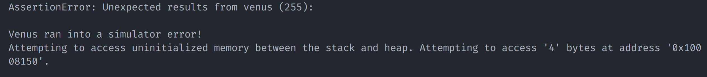

```assembly
free_memory:
    mv a0, s2
    jal free
    mv a0, s3
    jal free
    mv a0, s4
    jal free
    mv a0, s5
    jal free
    mv a0, s6
    jal free
    mv a0, s7
    jal free
    mv a0, s8
    jal free
    mv a0, s9
    jal free
    mv a0, s9
    jal free
```

释放两次 `s9`，访问未初始化内存，仍然出错。

单步调试发现：

```assembly
lw t0, 0(s4) # rc1[0]
lw t1, 4(s6) # input_rc[1]
mul a0, t0, t1 # rc1[0] * input_rc[1]
```

`lw t1, 4(s6)` 是越界访问的源头，不知道哪里错了。我用了一个保存 `4(s6)` 的值，但是还是出错。就这样吧。


3. 输出错误

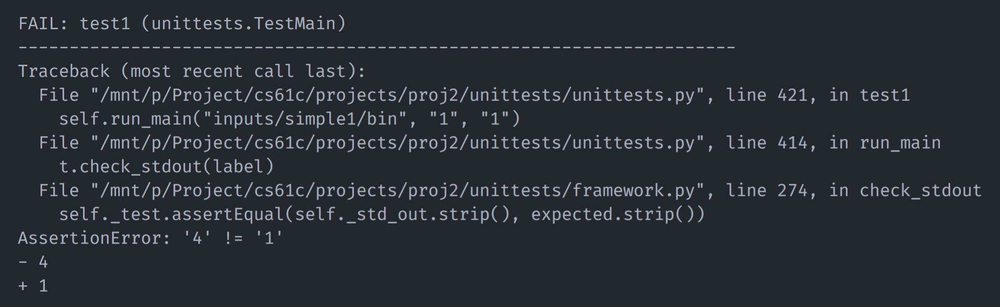

```assembly
# argmax: loop_continue
    # load next element
    lw t1, 0(a0) # temp_next = array[i]
    ble t1, s1, loop_continue # if temp_next <= max, jump to loop_continue
    mv s1, s1 # max = temp_next
    add s0, t0, x0 # max_index = i
    j loop_continue
```

其中 `s1` 更新错误，应为 `mv s1, t1`。

---

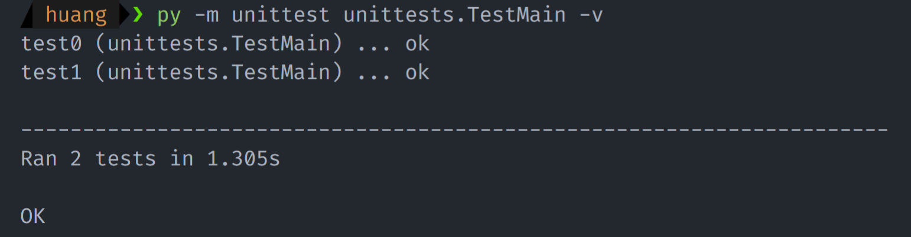

测试了以下 simple2，发现还是访问越界，直接把 `a0` 设为一个魔法值了。——除 simple0 和 simple1 外的测试都要自己写 reference，算了吧。

